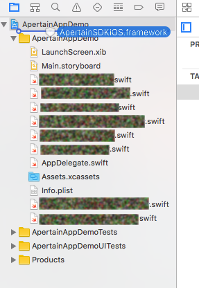
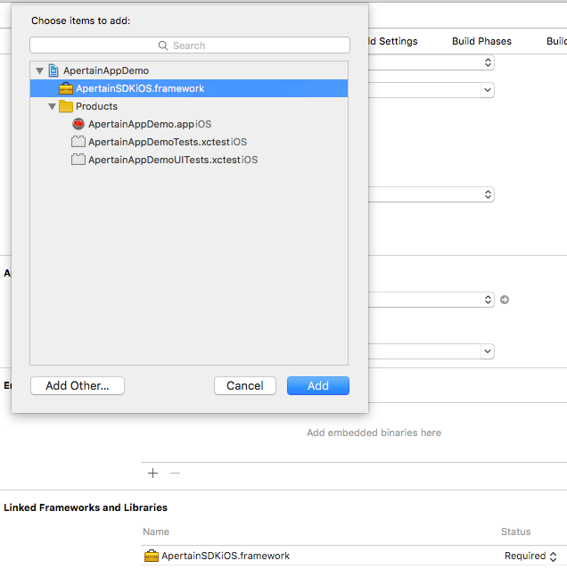
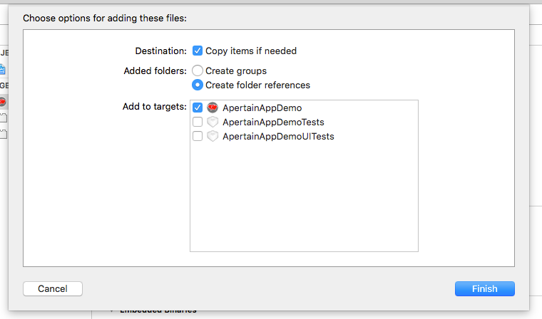
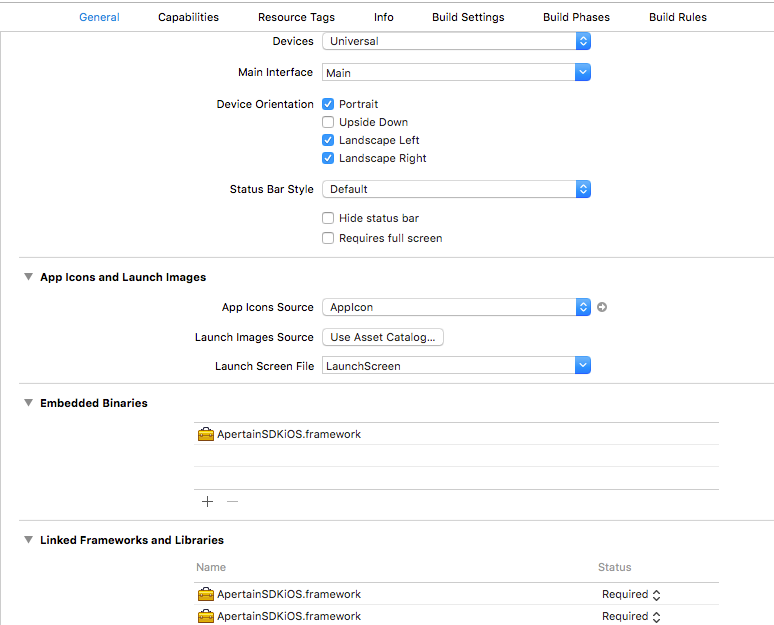
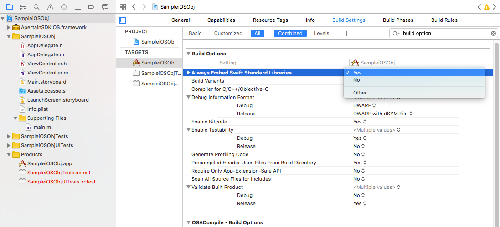
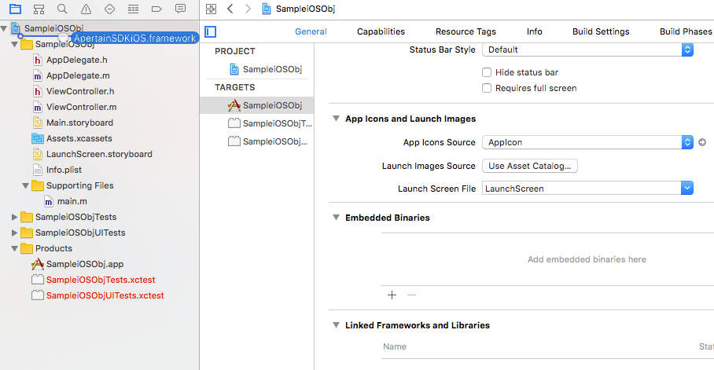
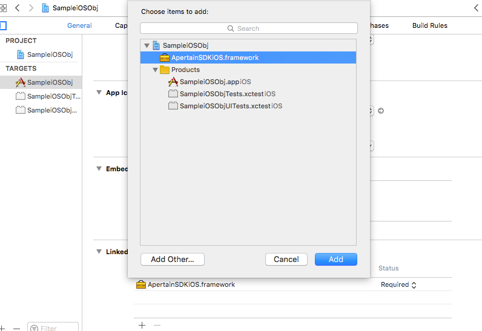
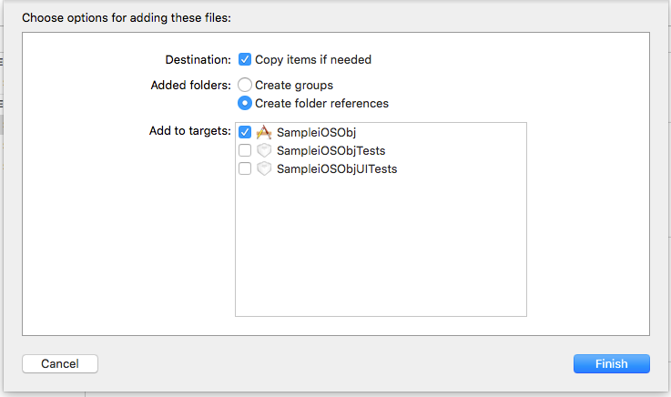
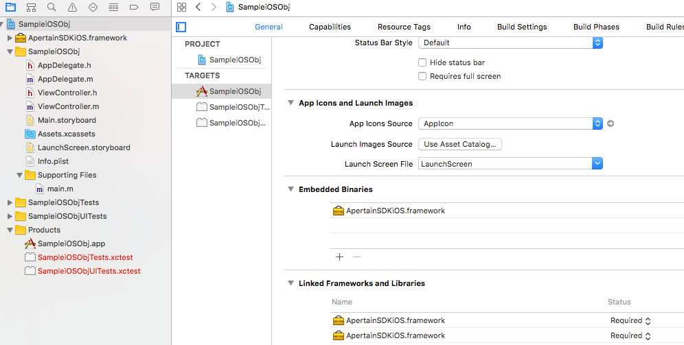

### 1. Integrating APertain SDK for iOS Xcode (Swift 3.0 and Objetive-C)

Integrating APertain SDK inside XCode for your App is pretty straight-forward. Please follow the below steps for a successful linking.

## Step 1. Linking APertain SDK Framework

Link with ApertainSDKiOS.framework(Drag and Drop) into your XCode (Swift Apps or Objective-C Apps)

	
## Step 2. Embed APertain SDK Binaries

Then Project General Settings -> Embedded Binaries -> Click (+) and can you see popup Screen  ApertainSDKiOS.framework Select and click Add button.

	
## Step 3. Reference of APertain SDK in App

If you need copy of ApertainiOS.Framework or No need to copy only reference of your Swift Apps or Objective-C Apps. 

#NOTE: It is recommended not to have a separate Copy within your App, as when you pull the latest from GitHub, you might need to repeat the above process again.
	
## Step 4. Final Project Structure

Finally project General settings tab can see like this both Swift Apps and Objective-C.

	
## Step 5. Importing APertain SDK in App

Just do import your App class for Swift

	import ApertainSDKiOS

For Objective-C you can import 

	#import <ApertainSDKiOS/ApertainSDKiOS.h>

## Step 6. Enabling Embedded Swift Standard in your Objective-C App.

#Note: Only for Objective-C.

Change Project Build Settings -> Build options -> Always embed Swift Standard Libraries -> Yes. See below Screen shot

